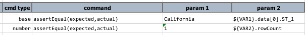
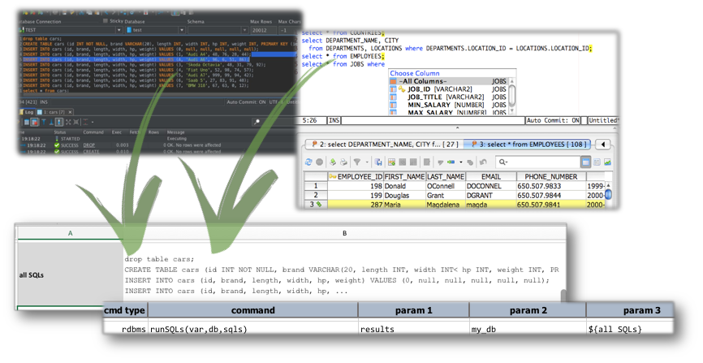
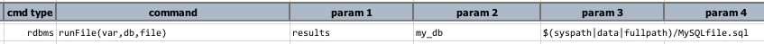

# Database Automation


<div class="site-links site-links-header">
<a class="link-previous" href="Database-Automation-dynamicsql.html">&laquo; Dynamic SQL / incorporate data variable</a> | 
<a class="link-next" href="Database-Automation-selectvalidate.html">SELECT to validate &raquo;</a>
</div>

## Section 3: SELECT to inspect
We've seen multiple examples in the [previous](Database-Automation-dynamicsql.html) section how one 
can use Nexial to display data from static or dynamically generated SQL queries.  In this section, 
we will dig deeper and focus on the the various aspects of what we can inspect from the execution
of one or more queries.


## SELECT one, SELECT all
Nexial supports both the execution of a single SQL or multiple SQL statements. We've already seen 
in action the `rdbms|runSQL(var,db,sql)` command.  There's also the 
<code>rdbms|runSQL**s**(var,db,**sqls**)</code> command:<br/>


The parameter `sqls` would be a multiple lines of SQL statements separated by semi-colon (`;`), 
just as the convention for most database tools.  In order for one to distinguish the result of
different SQL execution, one would _annotate_ each of the SQL statement with a SQL comment in the
form of `-- nexial:[VARIABLE]`, like this:
```sql
-- nexial:VAR1
SELECT ... ...

-- nexial:VAR2
INSERT INTO ... ...

-- more comments here, but this line is ignored by Nexial
-- however, the "Nexial" comment must be immediately preceeding the SQL statement
-- nexial:VAR3
call SP_... ...
```

After the execution of `runSQLs()` command, one could directly reference the variables referenced
in the SQL statements above, like so:<br/>


One obvious convenience with this is the fluidity of using the SQL statements developed on a
database tool/editor directly in Nexial.  You can simply copy the SQL statements to/from your
favorite database editors and Nexial datasheet.  Since the use SQL comment (via `-- `) and 
statement terminator (via `;`) are fairly universal.  The same SQL statements can be used in the
database editors and in Nexial.<br/>


To go one step further, Nexial also supports the execution of multiple SQL statements via a file:<br/>


This command behaves the same as `rdbms|runSQLs(var,db,sqls)` in terms of multiple SQL and Nexial 
variable support, but also the benefit of completely externalizing SQL statements out of Nexial 
artifacts.

## Inspect Results


***

<div class="site-links site-links-footer">
<a class="link-previous" href="Database-Automation-dynamicsql.html">&laquo; Dynamic SQL / incorporate data variable</a> | 
<a class="link-next" href="Database-Automation-selectvalidate.html">SELECT to validate &raquo;</a>
</div>
