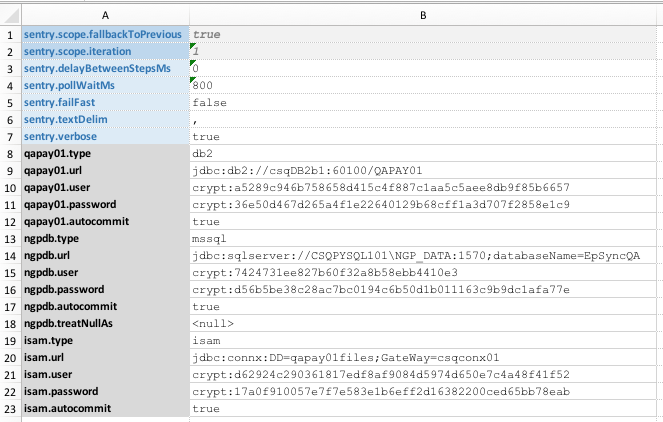
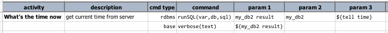
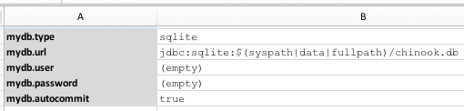
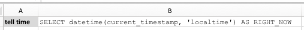
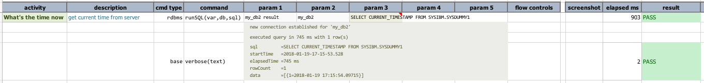

# Database Automation 


<div class="site-links">
<a class="link-none">&laquo; Previous</a> | 
<a class="link-next" href="Database-Automation-dynamicsql.html">Dynamic SQL / incorporate data variable &raquo;</a>
</div>

## Introduction
Just to be clear: automation may or may not be related to testing.  Certainly test automation is 
greatly desired due to its myriad of benefits.  But automation can include tasks that provides no 
intrinsic value towards product quality or test coverage.  Depending on how the script is set up, 
Nexial can be used for just _automation_ or for test automation.

Nexial provides a set of capabilities that interact with target database to extract, manipulate and 
validate its data.  Speaking of database, we are referring only to RDBMS.  Support for other types 
of database will be discussed separately.

## Section 1: Setup
First thing we need to do is to set up a _profile_ for each database connectivity we need.  
Essentially profile is how one sets up database connectivity in Nexial.  To do 
that, we would add connection details in data file, like this:<br/>


Here, we have 3 distinct database profiles specified:
- `qapay01`
- `ngpdb`
- `isam`

You can differentiate them by how these profile names are used as prefix to a set of data variables.  
This is the approach in Nexial to create complex data grouping, where an arbitrary "prefix" groups
a series of configuration together.  In this case, a database connection profile consists a set of 
data variables with the same 'prefix':

```
[PROFILE].type       = connx|db2|isam|mysql|oracle|postgresql|sqlite|sqlserver
[PROFILE].url        = jdbc:... ...
[PROFILE].user       = ...
[PROFILE].password   = ...
[PROFILE].automcommit= ...
[PROFILE].treatNullAs= ...
```

Check out [rdbms](../../documentation/commands/rdbms/) for more details.  We can add support for 
more database upon request.

Note the following:
1. Only `.type`, `.url`, `.user`, and `.password` are **REQUIRED**.
2. `.url` should represent the JDBC connection string specific to each database vendor.  Please 
   check vendor documentation for more details.
3. As of now, `connx` and `isam` are synonymous. The underlying JDBC connectivity to "isam" is 
   implemented through the [Connx JDBC driver](https://www.connx.com/databases.php), which is a JDBC 
   Type 3 driver. If you wish to connect to ISAM database, please obtain JDBC driver from Connx and 
   place it under `/lib` directory.  We might support other ISAM JDBC drivers in the future.
4. You can create as many profiles as needed, but make sure the profile names are unique and 
 contains no dot (`.`).
5. As a convinience, it might be best to put all these profiles in the `#default` data sheet so 
  that they can reuse for any test scenario.

Let's do a quick run to verify that the profile is set up correctly.  Here's the script that 
simply executes a query to retrieve the server's current time:<br/>


The corresponding [data file](../artifact/data/rdbms-01.data.xlsx) looks as follows:

| data sheet   |  content                                                  |
| :----------- | :-------------------------------------------------------- |
| [#default]   |           |
| [HelloWorld] |   |

The referenced [sqlite db](../artifact/data/chinook.db) is located in the data directory.

Here's the output: <br/>
```
nexial.[sh|cmd] -script [PROJECT_HOME]/artifact/script/rdbms-01.xlsx
```



We can see from the output that the SQL executed successfully (using profile `mydb`).  Looking at
the output, we can see that the database connection is established, and the `${tell time}` query
executed successfully.  The `base|verbose(text)` command simply prints out the textual representation
of the `${mydb result}`. The last line in the output is the resultset of this query: 
`data        =[{RIGHT_NOW=2018-01-21 21:12:09}]`

Great! Now let's see what else we can do with database automation.

***

<div class="site-links">
<span class="link-none">&laquo; Previous</span> | 
<span class="link-next"><a href="Database-Automation-dynamicsql.html">Dynamic SQL / incorporate data variable &raquo;</span>
</div>
