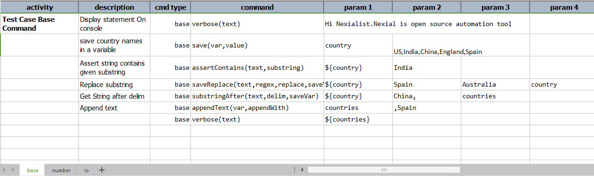
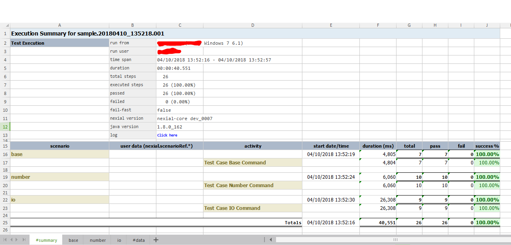
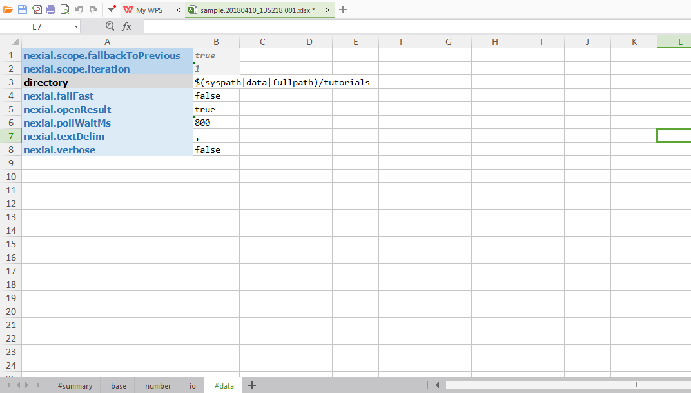
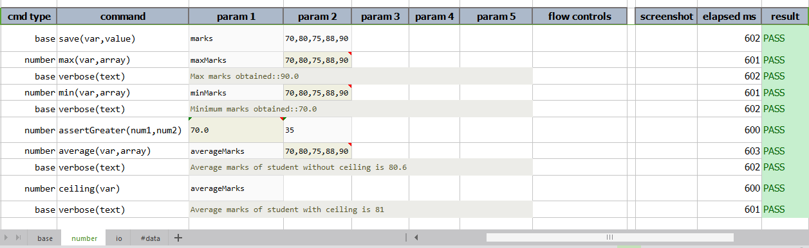

# Introduction
> Tutorials for Nexial, Test Automation for Everyone!

 

_excuse the mess while we are tidying up, do check in frequently as we will continue to add content here..._

---  

### What is Nexial? 
   Nexial is a test automation platform for automating web application, desktop application, API services. Automation Engineer without any prior coding experience/knowledge can use Nexial easily. For more details, **[`click here`](https://nexiality.github.io/documentation/userguide/IntroductionAndFAQ)**
 
### How does it work?
Nexial is totally based on spreadsheets.  
- test steps in spreadsheet(test script)
- enter test data in spreadsheet(test data) and execute Nexial command specifying spreadsheet to run
- read test scripts and test data and executes each test steps with appropriate command
- output generated in spreadsheet(test output)  
- Also we have test macro and test plans which will be discussed in next chapters.  

Let's have a quick look at Nexial Example using some basic commands with more description on spreadsheets.

### Nexial Examples
**Test Data:-** 
&nbsp;&nbsp;&nbsp;&nbsp;**#default** is the worksheet with some system variables. We can add variables in default sheet. Also we can create our own worksheet for data variables.
   
   

**Test Scripts:-** 
&nbsp;&nbsp;&nbsp;&nbsp; Let's go through test scripts. 
- **What is scenario?** Scenario is series of activity which is synonymous to worksheets of test scripts. 
- **What is activity?** Activity is nothing but the group of the test steps which has resemblance or indicates particular task. 
Activities further extend to test steps which includes cmd-type, command, params, flow controls.
- **cmd type** is collection of similar resembling commands.  
- **command** is the command of particular cmd type. Command has signature as **commandName(params...)**.  
- **Params** are the parameters to be passed to command. It is comma separated and needs respective parameters to be given in respective param. So first parameter must be in param 1 and second in param 2 column. 
For example, base cmd type has command save(var,value). It indicates that save command has two parameters var and value. var must be in param 1 and value in param 2.
- **flow controls** is to provide variable flow so as to modify test execution depending on condition given at respective step in this column. 
Let's have look at three scenarios **base, number, io** etc.
   
1. **base:-** 
    Base command is series of common automation commands for basic operations such as display output on console and save data in variable.
     
    Test Script:-  
    
2. **number:-** 
    Below is the example for calculating maximum, minimum and average marks. 
    
    Test Script:-  
    

3. **io:-** 
    Here we are dealing with some basic io operations such as create new directory, copy file into directory, read file, write file, list files and deleting files/folders.
        
    Test Script:-  
    
    

**Test Output:-** 
&nbsp;&nbsp;&nbsp;&nbsp;Test output is generated in project_path/output/\<timestamp\>/. Timestamp is the date_time of execution. The test output excel has **#summary**, **#data**, scenarios worksheets.  
    
- **#summary:-** 
    &nbsp;&nbsp;&nbsp;&nbsp;This worksheet shows the execution summary for the current execution. 
    Top section shows the summary of entire execution such as run configuration(nexial,java version), time span, total steps, passed, failed. Bottom section has scenario level summary such as duration, pass, fail, success % for each activity.  
     
        
- **#data:-**  
    &nbsp;&nbsp;&nbsp;&nbsp;This worksheet has all the data variables used for current execution. Refer this image: 
     
    
- Scenarios in output excel have **result** column which shows respective step is pass or fail. **elapsed ms** column display time taken to run respective step. 
   If you are referring variable through ${varName}, then variable value will be shown in output file.  
   For example,In base scenario, for assertContains we have used variable as ${country}. We can see value as "US,India,China,England,Spain" in output file. On mouseover we can see actual variable as ${country}. 
   
   Let's have look at output of above test scripts.
   
   1\. Base scenario:- 
   
    
   2\. Number scenario:- 
    
    
   3\. IO scenario:- 
   
    