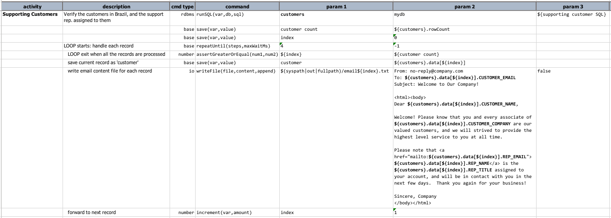
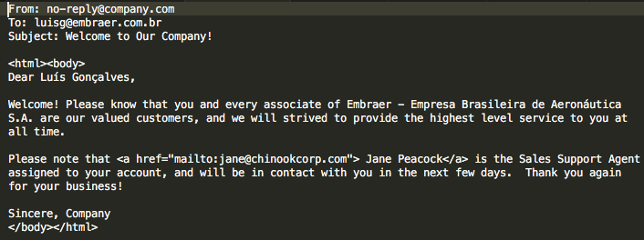
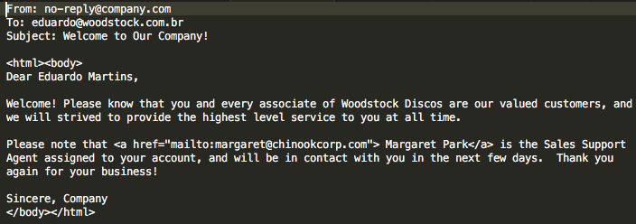
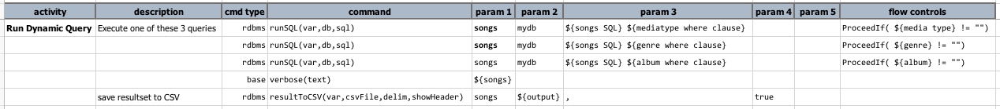
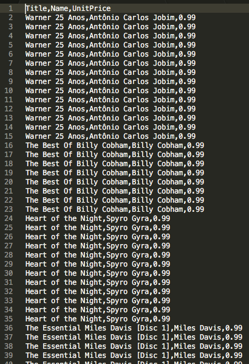
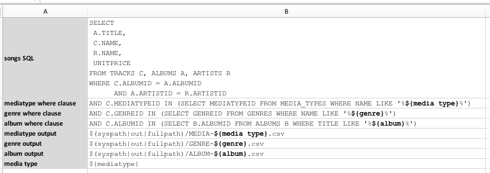
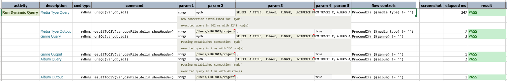
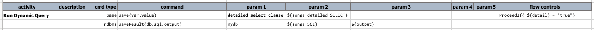
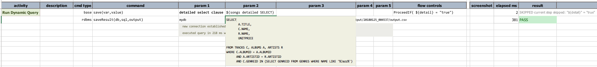

# Database Automation
 

<div class="site-links site-links-header">
<a class="link-previous" href="Database-Automation.html">&laquo; Introduction</a> | 
<a class="link-next" href="Database-Automation-selectinspect.html">SELECT to inspect &raquo;</a>
</div>


## Section 2: Dynamic SQL / incorporate data variable
Built within Nexial is the flexibility to dynamically construct "things" such as test data.  We 
will have a separate tutorial dedicated to that topic.  For now, we want to explore the 
possibility of constructing SQL query dynamically so that:
- our automation can react accordingly to external controls
- our automation can be reusable - like a template - towards similar scenarios
- one automation can integrate with other another automation script by utilizing the same
data variables

Throughout this tutorial, we will be using a sample [sqlite](http://www.sqlite.org/) database 
provided by the good people at [sqlitetutorial.net](http://www.sqlitetutorial.net/sqlite-sample-database/).  
As a point of reference, this sample database has the following ERD:

[](http://www.sqlitetutorial.net/sqlite-sample-database/)

The examples shown here can be found in [this script](../../artifact/script/rdbms-02.xlsx) and its 
corresponding [data file](../../artifact/data/rdbms-02.data.xlsx).

Now let's see some examples!

------------------------------------------------------------------------------------------------------------------------


## Example 1: Parameterizing SQL
We'll start with a simple example. With Nexial, we can construct a SQL statement with dynamic data 
fairly effortlessly.  In essense, we can use the `${...}` syntax to substitute a variable with its 
value.  For example,

| variable name | value                        |
| :------------ | :--------------------------- |
| first name    | John                         |
| last name     | Denver                       |
| full name     | `${first name} ${last name}` |

As such, and as one would expect, `${full name}` would resolve to `John Denver`.

Here's our example in action.  The data file contains 2 data sheets:

| data sheet    |  content                                            |
| :------------ | :-------------------------------------------------- |
| [#default]    |                    |
| [DynamicSQL1] |  |

The `supporting customer SQL` is otherwise a normal SQL, except with the use of `${...}`.  This
allows for the inclusion of dynamic data.  The said query would render as follows:

```
SELECT
	C.COMPANY                        AS CUSTOMER_COMPANY,
	C.FIRSTNAME || ' ' || C.LASTNAME AS CUSTOMER_NAME,
	C.EMAIL                          AS CUSTOMER_EMAIL,
	E.TITLE                          AS REP_TITLE,
	E.FIRSTNAME || ' ' || E.LASTNAME AS REP_NAME,
	E.EMAIL                          AS REP_EMAIL
FROM customers C, employees E
WHERE
	C.SUPPORTREPID = E.EMPLOYEEID AND
	C.COUNTRY = 'Brazil'
ORDER BY REP_NAME, CUSTOMER_NAME;
```

So now, if we would to change `customer country` to another value, like `Germany`, then the SQL
would render dynamically to the new value.

Notice that Nexial will automatically trim away the trailing semi-colon as well - a convenience 
in case you are copying a query from your favourite database editor or from another SQL file.

Our script contains a query execution and a series of assertions:<br/>


First we execute the query represented by `${supporting customer SQL}`.  Then a series of 
assertions on the query result:
1. Make sure exactly 5 rows are returned
2. Make sure that `Jane Peacock`, `Steven Johnson` and `Margaret Park` are all supporting 
representatives for the Brazil customers.

Before executing the script, let's see what this query would render:<br/>


So if everything goes as plan, our script would return 100% PASS.  Let's run it:

```
nexial.[sh|cmd] -script [PROJECT_HOME]/artifact/script/rdbms-02.xlsx -scenario DynamicSQL1
```

The output confirms the expected outcome:<br/>


> **We can apply this simple technique across multiple variables and we can use the same variable
over multiple queries.** 


## Example 2: Looping Through Resultset
As an idea of what one can do with dynamic SQL, here's a slight modification to the same example:<br/>


Instead of asserting query result, we can loop through the resultset to dynamically generate 
external content.  In this case, we are generating what would have been a customer-specific 
marketing email content.  By using `base|repeatUntil(steps,maxWaitMs)` command we can loop
through a series of commands, such as generating email content for each row of the resultset. The
resulting output looks something like this:<br/>


The respective email content are as follows:<br/>





## Example 3: Just-in-time WHERE clause construction
Continue the idea of generating SQL statement dynamically, we can also generate the entire WHERE 
clause, or a portion of it, dynamically.  Using flow control, we can control the test steps is
execute or to skip.  

Let's see an example:<br/>


Here, the data file contains a SQL statement (named as `songs SQL`).  We have also a bunch of 
_partial WHERE clauses_:

- `mediatype where clause`: partial WHERE clause to limit the resultset to the specified media type
- `genre where clause`: partial WHERE clause to limit the resultset to specified music genre
- `album where clause`: partial WHERE clause to limit the resultset to specified album

The general idea is to append one of these _partial WHERE clauses_ to `${song SQL}` and thus modify
the impact of the said query.  In order to do so dynamically, we want to control the query 
modification via [flow control](../../../documentation/flowcontrols/).

Take a look at the script:<br/>


Notice the `ProceedIf(...)` statements under the **flow controls** column.  This is how you read it:

| flow control                      | read as                                                                                          |
|:----------------------------------|:-------------------------------------------------------------------------------------------------|
| `ProceedIf( ${media type} != "")` | "_If the data variable `media type` is defined with non-empty value, execute current test step_" |
| `ProceedIf( ${genre} != "")`      | "_If the data variable `genre` is defined with non-empty value, execute current test step_"      |
| `ProceedIf( ${album} != "")`      | "_If the data variable `album` is defined with non-empty value, execute current test step_"      |

Look at the data file again (above), we have a data variable `genre` defined with value `Jazz`.  So 
this means the test step with the flow control `ProceedIf( ${genre} != "")` will execute since 
`Jazz` is not non-empty value.  Whilst the test step with `ProceedIf( ${media type} != "")` will 
not execute, and the test step with `ProceedIf( ${album} != "")` will not execute either.

The end result: the following SQL will be executed:

```
SELECT
        A.TITLE,
        C.NAME,
        R.NAME,
        UNITPRICE
FROM TRACKS C, ALBUMS A, ARTISTS R
WHERE C.ALBUMID = A.ALBUMID
      AND A.ARTISTID = R.ARTISTID AND C.GENREID IN (SELECT GENREID FROM GENRES WHERE NAME LIKE '%Jazz%')
```

The last line of the above SQL comes from `${genre where clause}`.  This is in agreement with the 
executed test step, which basically combines `${songs SQL}` and `${genre where clause}` as one query.

Executing this example:
```
nexial.[sh|cmd] -script [PROJECT_HOME]/artifact/script/rdbms-02.xlsx -scenario DynamicSQL2
```

Output:<br/>


Observe that the first and third commands were _SKIPPED_ since the condition in their respective 
flow control was not met.

The last command saved the output to a CSV file (excerpt below):<br/>


And yes, they are all Jazz records! 😎


## Example 4: Runtime Data Variable Overrides
Continue with the same idea as previous example, we can dynamically create SQL queries using 
runtime data variable override.  What we saw in the last example is to declare the data variable in
the data file to control the query generation.  In the last example, since a data variable named
`genre` was declared with value `Jazz`, the second test step was invoked while the first and third
test steps were skipped.

But we can also declare data variable, or override declared data variable, at runtime.  

#### [sidebar] >>>
> Before we go further, a bit of explanation is warranted here.  In our script and data file, we 
reference a data variable named `media type`.  While it is possible to define such variable at
runtime via the above method (i.e. using `export ` or `set` command), having a space in the 
variable name makes it a fair bit more difficult.  This has to do with how the space character
is treated by the shell or command prompt.
> 
> To make things simpler, we could modify our script to reference `mediatype` instead of 
`media type`.  Or we could define `mediatype` at runtime, and the assign the value of `mediatype`
to `media type` in our script:
>
>     media type | ${mediatype}
>
> Let's see this idea in action...

(OSX/*NIX)
```
export JAVA_OPT=-Dmediatype=MPEG
nexial.sh -script [PROJECT_HOME]/artifact/script/rdbms-02.xlsx -scenario DynamicSQL2a
```

(Windows)
```
set JAVA_OPT=-Dmediatype=MPEG
nexial.cmd -script [PROJECT_HOME]\artifact\script\rdbms-02.xlsx -scenario DynamicSQL2a
```

Here's the data file for this example:<br/>


The value assignment is at the last line.

The script uses the same flow control to control multiple test steps.  Notice that we are still
referencing to `media type` here:<br/>


The output shows that the test steps controlled by `genre` and `album` are skipped:<br/>


Suppose we define value for `genre` and `album` instead:

(OSX/*NIX)
```
export JAVA_OPT="-Dgenre=Jazz -Dalbum=One"
nexial.sh -script [PROJECT_HOME]/artifact/script/rdbms-02.xlsx -scenario DynamicSQL2a
```

(Windows)
```
set JAVA_OPT=-Dgenre=Jazz -Dalbum=One
nexial.cmd -script [PROJECT_HOME]\artifact\script\rdbms-02.xlsx -scenario DynamicSQL2a
```

The output, just as expected:<br/>


#### Wait, there's more!
There is _YET_ another way to handle the issue with data variable names that contain space(s).  
And there are multiple added benefits to this technique as well.

It turns out that Nexial provides another way to specify data variables besides using data file and
`set|export JAVA_OPT=...` command line.  Nexial provides a convenient way to manage all the runtime 
override into a file, which loads at the start of an execution.  This optional file - as part of 
Nexial convention - must be found in `[PROJECT]/artifact/projects.properties`.  Let's see this 
feature in action:

`[PROJECT]/artifact/projects.properties`:
```
media type=MPEG
album=One
genre=Jazz
nexial.assistantMode=on
```

Any of the Nexial system variable or project-level data variable can be entered here as runtime 
override.  Let's run the same script now:

```
nexial.[sh|cmd] -script [PROJECT_HOME]/artifact/script/rdbms-02.xlsx -scenario DynamicSQL2a
```

You can find a [sample project.properties here](../../artifact/RENAME_TO_project.properties), which 
you will need to rename from `RENAME_TO_projects.properties` to `project.properties` in order for 
it to take effect.




Sure enough, since all the 3 data variables are defined, all the test steps were executed!


## Example 5: Dynamic SELECT clause 
How about dynamic SELECT clause instead? If we can dynamically generate the WHERE clause, this 
should be reasonably attainable.  In fact any part of a SQL statement can be dynamically rendered.
From Nexial's standpoint, this is by and large variable and text manipulation.

Let's say we need to display a 'simplified' and 'detailed' view of the same set of data.  We could 
simply create two nearly identical SQL statements.  But this might incur ongoing maintenance and our
script might get more complicated.  Alternatively, we can dynamically inject additional columns to 
the same 'simplified' SQL statement - thus keeping all the WHERE clause intact.  Like this:

Data file:<br/>


Script:<br/>


Here, we create a data variable, `songs detailed SELECT`, that holds the additional SELECT clause 
(more columns).  Then in the script, we dynamically merge `songs detailed SELECT` into `songs SQL` 
via the value of `detail`.  As you can see, `detail` is not defined in the data sheet.  Once
again, we can utilize the runtime override capability of Nexial:


##### Run #1:
```
set|export JAVA_OPT=-Ddetail=false
nexial.[sh|cmd] -script [PROJECT_HOME]/artifact/sript/rdbms-02.xlsx -scenario DynamicsSQL3
```

Output - observe the generated SQL statement only has 4 columns:<br/>


The generated CSV file reflects the same:<br/>


##### Run #2:
```
set|export JAVA_OPT=-Ddetail=true
nexial.[sh|cmd] -script [PROJECT_HOME]/artifact/sript/rdbms-02.xlsx -scenario DynamicsSQL3
```

Output - observe the generated SQL statement with the inclusion of additional columns after `UNITPRICE`:<br/>


The generated CSV file reflects the same:<br/>


There's a much more powerful way to generate dynamic SQL using Nexial Expression.  We will cover 
this in a later tutorial.

In the next section we'll get a better understand of what we can inspect from a SELECT query.

***

<div class="site-links site-links-footer">
<a class="link-previous" href="Database-Automation.html">&laquo; Introduction</a> | 
<a class="link-next" href="Database-Automation-selectinspect.html">SELECT to inspect &raquo;</a>
</div>
