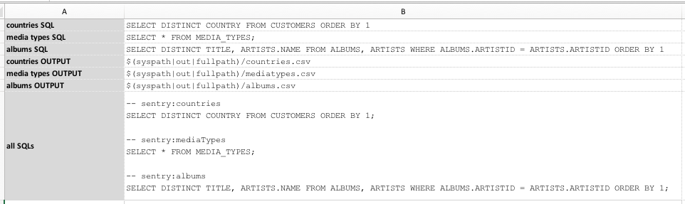
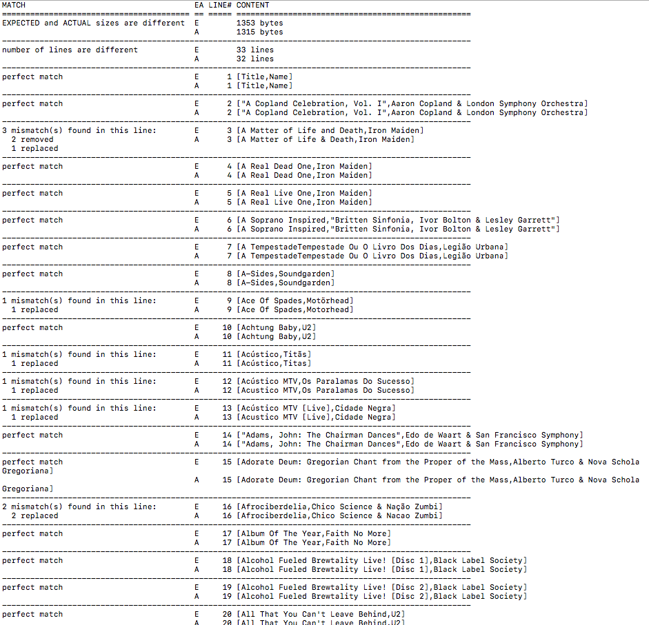

# Database Automation

<a class="link-previous" href="Database-Automation-selectvalidate.html">&laquo; SELECT to validate</a> | 
<a class="link-next" href="Database-Automation-metadata.html">Query metadata &raquo;</a>

## Section 5: SELECT to CSV / bulk comparison

## Compare Query Results

## Compare Query Results, Take 2

The first two comparisons ran as expected - no differences found: 

However the last comparison shows multiple variance between the two CSV output: 

I should say that this is _also_ expected since the underlying queries for them are different.

## Compare Against Baseline File

***

<a class="link-previous" href="Database-Automation-selectvalidate.html">&laquo; SELECT to validate</a> | 
<a class="link-next" href="Database-Automation-metadata.html">Query metadata &raquo;</a>

