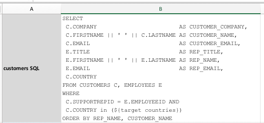
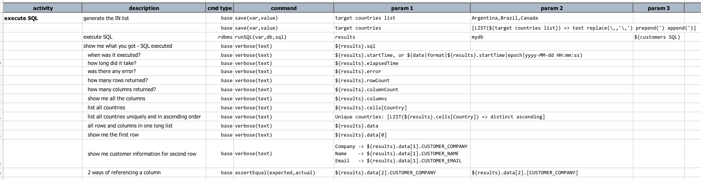
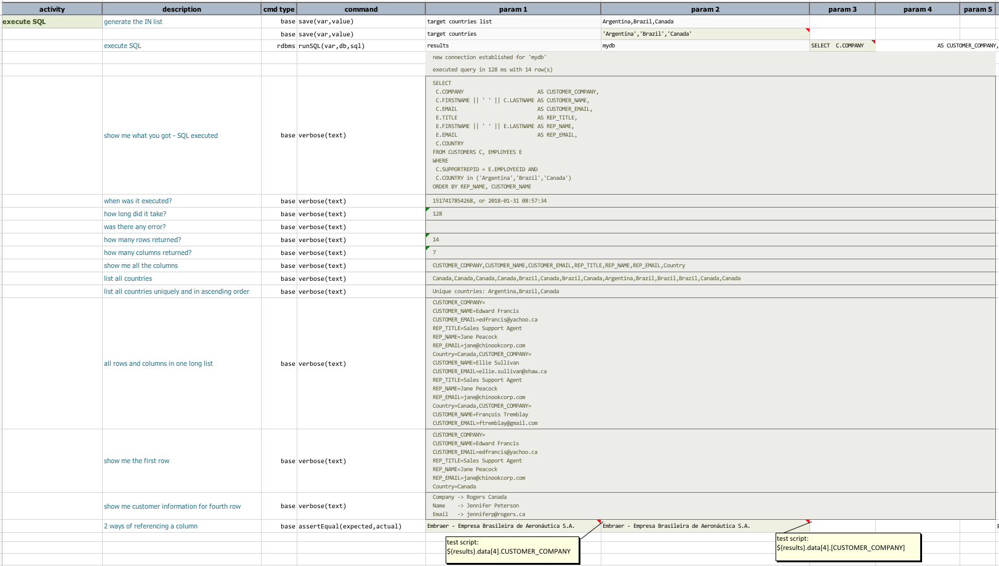

# Database Automation

<a class="link-previous" href="Database-Automation-dynamicsql.html">&laquo; Dynamic SQL / incorporate data variable</a> | 
<a class="link-next" href="Database-Automation-selectvalidate.html">SELECT to validate &raquo;</a>

## Section 3: SELECT to inspect
We've seen multiple examples in the [previous](Database-Automation-dynamicsql.html) section how one 
can use Nexial to display data from static or dynamically generated SQL queries.  In this section, 
we will dig deeper and focus on the the various aspects of what we can inspect from the executing 
SQL queries.

## Inspect Results
In this example, we are targeting against the same sample database in the 
[previous section]((Database-Automation-dynamicsql.html)): 

The examples shown here can be found in [this script](../../artifact/script/rdbms-03.xlsx) and its 
corresponding [data file](../../artifact/data/rdbms-03.data.xlsx).

Here's our data file: 

In the script, we execute the query specified in the data file, and then print out the various 
execution details available via Nexial: 

The first line is self-explanatary: saving `Argentina,Brazil,Canada` to a variable named `target countries list`.

The second line uses another feature of Nexial called Nexial Expression.  Visit the 
tutorial specific to Nexial Expression for better understanding of it.  In this case,

| cmd type   | command           | param 1            | param 2                                   |
|:-----------|:------------------|:-------------------|:------------------------------------------|
| `base`     |	`save(var,value)`	| `target countries` |	`[LIST(${target countries list}) => text replace(\,,'\,') prepend(') append(')]` |

means:
1. treat `${target countries}` as a LIST, which it is since we defined it in the preceeding command 
   as a comma-separated list.
2. as a LIST, convert it to TEXT (meaning just characters), then
3. replace all instances of `,` with `','` so that `Argentina,Brazil,Canada` becomes `Argentina','Brazil','Canada`
4. then, add a single quote to the front of it so that `Argentina','Brazil','Canada` becomes `'Argentina','Brazil','Canada` 
5. then, add a single quote to the end of it so that `'Argentina','Brazil','Canada` becomes `'Argentina','Brazil','Canada'`
6. finally save it to another variable `target countries`.

The third line executes `${customers SQL}` as a query, which will make use of `${target countries}` 
created in line two.

The rest of the commands print out the various metadata and resultset of this execution.  Below is 
a sample output: 

The above example shows that one can retrieve both the resultset and the metadata of an execution
via Nexial.  Metadata available for retrieval would be:
- `${...}.sql` - the query executed.
- `${...}.startTime` - represents the date/time when the query was executed, in
  [epoch](https://en.wikipedia.org/wiki/Unix_time). To convert into humanly readable format, use 
  the Nexial built-in function `$(date|format|date_time_value|from|to)`.
- `${...}.elapsedTime` - expressed in millisecond, which is consistent with the rest of Nexial.
- `${...}.error` - shows the error (as rendered from underlying database) incurred during execution. 
  If none is found, empty string is rendered.
- `${...}.rowCount`
- `${...}.columnCount`
- `${...}.columns` - the list of column names as rendered by underlying database.

Query result can be retrieved via the following syntax:
- `${...}.data` - represents the entire resultset returned from executing a query.  To retrieve a 
  specific row, use the `${...}.data[row_number]` syntax where `row_number` is zero-based. 
- `${...}.data[row_number].COLUMN_NAME` - this is the syntax to retrieve a specific cell.  However 
  if the target column contains spaces, then one can use the following syntax instead: 
  `${...}.data[row_number].[CUSTOMER_NAME]`
- `${...}.cells[COLUMN_NAME]` - this retrieves the data column-wise (instead of row-wise) so that 
  one can access the resultset data belonging to the same column.

Retrieving data via be `${...}.data[row_number].COLUMN_NAME` syntax might seem too tedious or low-
level.  But it gives us the precision needed at times.  We will see in later section how to perform 
data comparison or processing at scale - across the entire resultset.

In the next section, let's explore ways to utilize both the metadata and query data for validation.

***

<a class="link-previous" href="Database-Automation-dynamicsql.html">&laquo; Dynamic SQL / incorporate data variable</a> | 
<a class="link-next" href="Database-Automation-selectvalidate.html">SELECT to validate &raquo;</a>

