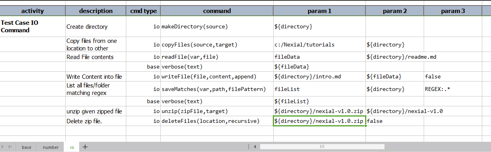

# Nexial Primer

## What is Nexial?
Nexial is a test automation platform for automating web applications, desktop applications, API services, databases 
operations and many more. Automation Engineer without any prior coding experience/knowledge can easily use Nexial to 
carry out test automation (or _just_ automation in general) against intended target applications and systems. For more 
details, visit **[Nexial Introduction](https://nexiality.github.io/documentation/userguide/IntroductionAndFAQ)**.


## How does it work?
Scripting is completely captured via Excel spreadsheets. Nexial provides the "interpretation" capability to translate
the automation intent as captured in spreadsheets and turn them into execution. Here is the high level flow of 
activities between the Automation Engineer (AE) and Nexial:
1. AE enters the intended steps in the script (Excel). Each step consist of a command (select from 
   a dropdown list in Excel), 1-5 parameters, and (optional) flow control declarative.
2. AE enters the test data in the data file (Excel) and references them in the script in the form of `${...}`.
3. AE opens a command console/terminal and points the command prompt to the `bin/` directory of Nexial distro (dubbed as 
   `NEXIAL_HOME`).<br/>
   (Mac/*Nix): ```cd $NEXIAL_HOME/bin ``` <br/>
   (Windows): ```cd %NEXIAL_HOME%\bin```
4. AE runs the automation script by executing the following command:<br/>
   (Mac/*Nix): ```./nexial.sh -script <FULLY QUALIFIED PATH TO THE SCRIPT>```<br>
   (Windows): ```nexial.cmd -script <FULLY QUALIFIED PATH TO THE SCRIPT>```
5. Nexial will read the specified test script and the derived data file.
6. For each referenced data variable (`${...}`) found in command parameters, Nexial will substitute it with the 
   associated value found in the data file.
7. For each specified step, Nexial will perform the associate automation/code.
8. The execution output is generated as a spreadsheet which mimics the structure and layout of the test script.
9. AE reviews the execution output and adjusts the test script and/or data as needed.

Note that Nexial also supports the concept of "macro", which can be embedded into one or more scripts. This will be 
discussed in more details in the later section.


## Understanding Test Script and Test Data
### Test Scripts
Let's look at the 
[various key components of a test script](https://nexiality.github.io/documentation/userguide/UnderstandingExcelTemplates#anatomy-of-a-nexial-script):
- **Step** is the smallest construct of an Nexial execution. It represents one atomic action of automation. A step 
  consists of the following:
  - **description** is the narrative of a step.
  - **cmd type** is the group name of a command. Nexial classifies similar or related commands as a collection, and 
    "cmd type" (read: command type) is the name of such collection. The "cmd type" are shown as a dropdown list. 
  - **command** is the name of the command, which is shown as a dropdown list. A command is named in the form of 
    **`command(param1,param2,...)`** so there is no guesswork as the number of parameters needed per command. This 
    naming convention also works as a visual cue in terms of the parameters needed per command. For example,
    web &raquo; `open(url)` indicates 1 parameter required and this parameter represents the URL with which to open a
    browser.  
  - **param 1, param 2...** are the parameters to be passed to selected command. First parameter is captured as 
    "param 1", the second parameter as "param 2", and so on. For example, the command base &raquo; `save(var,value)` 
    indicates two parameters `var` and `value`, in that order. So `var` must be expressed in the  "param 1" column and 
    `value` in the "param 2" column.
  - **flow controls** provides optional [flow control](https://nexiality.github.io/documentation/flowcontrols/) to 
    execution based on runtime/dynamic condition at the point of executing a given step.
  - **screenshot** is used to capture screenshot after a step is execution. Simply put a **`x`** in this column to 
    indicate the desire to capture screenshot. **Note** that is only applicable for desktop and web commands. 

- **Activity** is an organizational construct to group a set of contiguous steps. It provides a visual cue to the flow
  and purpose of a script. Furthermore, Nexial will group the execution result by Activity as well.

- **Scenario** is a series of Activities in the same worksheet (of a spreadsheet). One can also think of a Scenario 
  as a series of steps to execute in succession. For any given script, Nexial does not take into consideration the 
  entire spreadsheet since this would be rather inefficient. Instead, Nexial wil parse the scripts, starting from 
  Row 5 (the row just below the heading), until a blank row is encountered.<br/>
  The steps within one Scenario are designed to be executed in one-go. From the execution standpoint, a scenario is the 
  smallest executable grouping. This means that the smallest "amount" one can instruct Nexial to execution would be 1 
  Scenario. For example:
  ```
  ./nexial.sh -script ~/projects/MyProject/artifact/script/MyAwesomeScript.xlsx -scenario Scenario1
  ``` 


### Test Data
Read about the structure of a 
[Nexial Data File](https://nexiality.github.io/documentation/userguide/UnderstandingExcelTemplates#anatomy-of-a-nexial-data-file).

In general, there are 2 types of data variables. One are those prefixed with `nexial.` - these are called 
[System Variables](https://nexiality.github.io/documentation/systemvars/). They are designed to manipulate how Nexial 
behaves during execution. The other type is user-defined data variables, which can be named any way you like as long as
they conform to the following:
1. They don't start with `nexial.`
2. They don't contain `$`, `{` or `}` character as part of its name.
3. They don't contain newline, carriage return or tab characters.

These data variables can be defined in a variety of locations. By convention, there should be a data file matching by 
name to the script file. So a script in `C:\projects\MyProject\artifact\script\Script097.xlsx` would have a matching
data file in `C:\projects\MyProject\artifact\data\Script097.data.xlsx`. Note:
- the file locations - `artifact\script` vs `artifact\data`, and 
- the file names - `<script>.xlsx` vs `<script>.data.xlsx`. 

This convention can be easily overwritten via command line arguments. For example,
```
nexial.cmd -script C:\projects\MyProject\artifact\script\Script097.xlsx -data C:\someotherplace\MyDataFile.xlsx
```

Each data file by default comes with a designated `#default` worksheet. This worksheet, or data sheet, is considered as
the fallback. One can add all the common data variables in this data sheet, and then optionally overwrite some of them
in the scenario-specific data sheets. Again, by convention, each scenario is thought to be matched by a data sheet that
is named the same. So a scenario named `Login` in `C:\projects\MyProject\artifact\script\Script097.xlsx` would be 
matched by a data sheet named `Login` in `C:\projects\MyProject\artifact\data\Script097.data.xlsx`.

Similarly this convention can be easily overwritten via command line arguments:
```
nexial.cmd -script C:\projects\MyProject\artifact\script\Script097.xlsx -scenario Login \
           -data   C:\someotherplace\MyDataFile.xlsx                    -datasheets MyOwnData
```


## Nexial Examples
Let's use the following examples to further understand the basic capabilities of Nexial commands.
1. **base**<br/>
   The `base` command is series of common automation commands for basic operations such as assertion, saving data 
   variables and displaying output.

   Test Script:
   

2. **number**<br/>
   Below is the example for calculating maximum, minimum and average marks. 
    
   Test Script:<br/>
   

3. **io**<br/>
   Here we are dealing with some basic io operations such as create new directory, copy file into directory, read file, 
   write file, list files and deleting files/folders.
        
   Test Script:<br/>
   

4. **Test Output**<br/>
   Test output is generated in `$PROJECT_HOME/output/<timestamp>/`. Timestamp is the starting date/time of the 
   execution. The test output excel contains the **`#summary`**, **`#data`** and the executed scenarios worksheets. 

   - **#summary**<br/>
     This worksheet shows the execution summary for the current execution. Top section shows the summary of entire 
     execution such as run configuration(nexial,java version), time span, total steps, passed, failed. Bottom section 
     has scenario level summary such as duration, pass, fail, success % for each activity. <br/>
     

   - **#data**<br/> 
     This worksheet has all the data variables used for current execution.<br/>
     
    
   - Each executed scenario output contains **result** column which shows the result of each respective step 
     (`PASS`, `FAIL`, `WARN` or `SKIP`). The **elapsed ms** display time taken to execute a step. In the scenario output 
     each of the data variables are replaced with the actual value. For example, in the `base` scenario (see below), 
     the `assertContains(text,substring)` command had its first parameter as `${country}`. In the output `${country}` is 
     replaced with `US,India,China,England,Spain`.

     1. The `base` scenario output:<br/>
        
     2. The `number` scenario output:<br/>
        
     3. The `io` scenario output:<br/>
        

_More to come..._