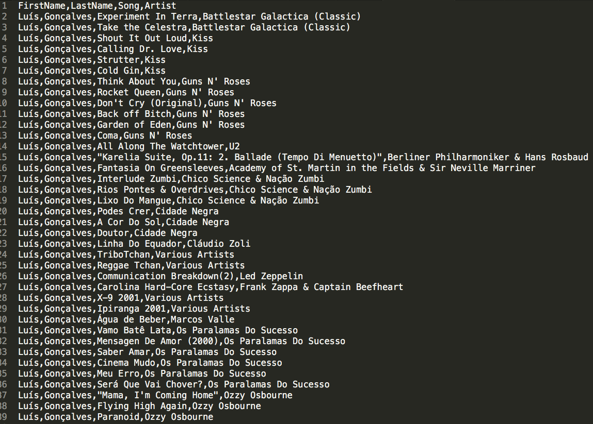
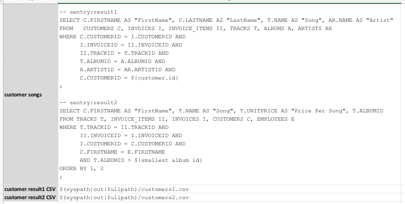
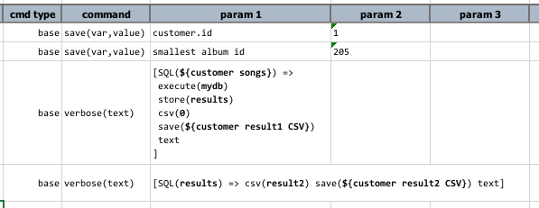
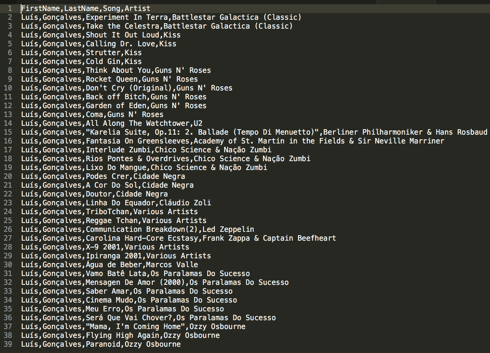

# Database Automation

<a class="link-next" href="update.html">&laquo; UPDATE database</a> | 
<a class="link-next" href="template.html">Template-based SQL Generation &raquo;</a>

## Section 8: Nexial Expression for database automation

## From Query To CSV, _express_ way!

## Take 2: more than one resultset

***

<a class="link-next" href="update.html">&laquo; UPDATE database</a> | 
<a class="link-next" href="template.html">Template-based SQL Generation &raquo;</a>

