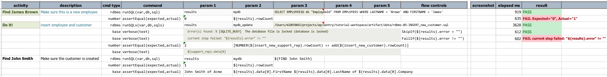
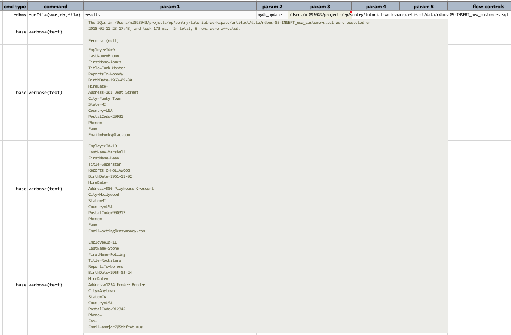

# Database Automation

<a class="link-previous" href="multisql.html">&laquo; Multiple SQLs</a> | 
<a class="link-next" href="expression.html">Nexial Expression &raquo;</a>

## Section 7: UPDATE database

Multiple SQL in one file, update queries can also be named

## Transaction Error

Suppose there is concurrent access to the same table during the above test execution.  This could 
possibly lead to database failure.  In such case, sine we've defined our database without autocommit 
(see the above; `myb_update.autocommit|false`), error amidst in-progress transaction would rollback 
such transaction.  Here's how such condition would show up in test result: 

## Collective Result

## Transaction Support

***

<a class="link-previous" href="multisql.html">&laquo; Multiple SQLs</a> | 
<a class="link-next" href="expression.html">Nexial Expression &raquo;</a>

